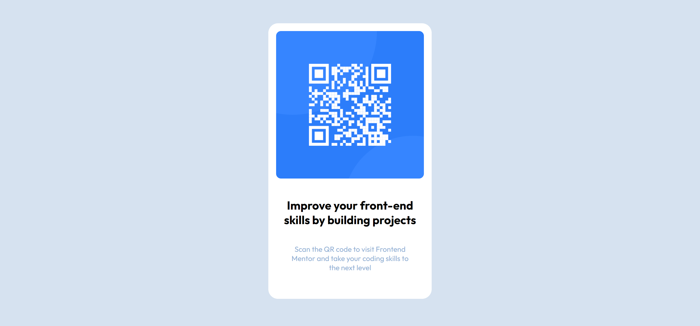

# Frontend Mentor - QR code component solution

This is a solution to the [QR code component challenge on Frontend Mentor](https://www.frontendmentor.io/challenges/qr-code-component-iux_sIO_H). Frontend Mentor challenges help you improve your coding skills by building realistic projects. 

## Table of contents

- [Overview](#overview)
  - [Screenshot](#screenshot)
  - [Links](#links)
  - [Built with](#built-with)
  - [What I learned](#what-i-learned)
  - [Continued development](#continued-development)
  - [Author](#author)

## Overview
I love this excercise because it helps me to freely play with container, margin and padding for responsiveness withouyt having to set a fix height except for the width. I only make use of html and css and just a one line media querry to make it responsive.

### Screenshot




### Links

- Solution URL: [Add solution URL here](https://your-solution-url.com)
- Live Site URL: [Add live site URL here](https://your-live-site-url.com)

### Built with

- Semantic HTML5 markup
- CSS custom properties
- Mobile-first workflow

### What I learned
I was able to see the effect of the below css pproperties:

```css
.proud-of-this-css {
  max-width: 100%;
  box-sizing: border-box;
}

### Continued development

I really want to learn to design more responsive web pages with html and css.

## Author

- Website - [Add your name here](https://www.your-site.com)
- Frontend Mentor - [@xpdiita](https://www.frontendmentor.io/profile/xpdigita)
- Twitter - [@yourusername](https://www.twitter.com/yourusername)
